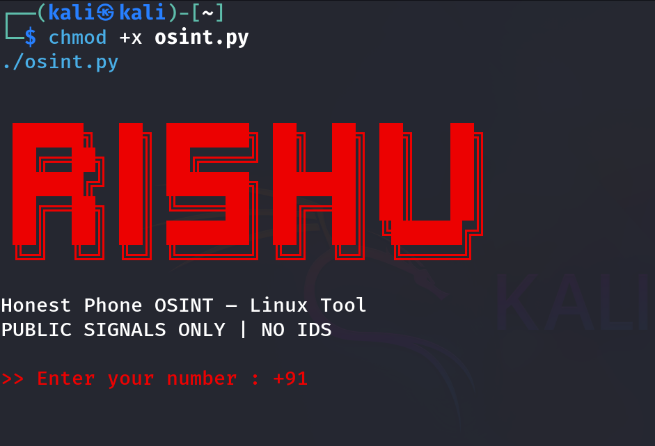

# RISHU – Honest Phone OSINT Tool (Linux)




This is a Linux-based Python OSINT tool created for educational purposes.
It analyzes phone numbers using only public signals.

## Features
- Linux command-line tool
- Red hacker-style banner
- Indian number input (+91 auto)
- Country detection
- Social platform presence (YES / NO only)
- No fake operator or identity claims

## Usage
```bash
chmod +x osint.py
./osint.py
